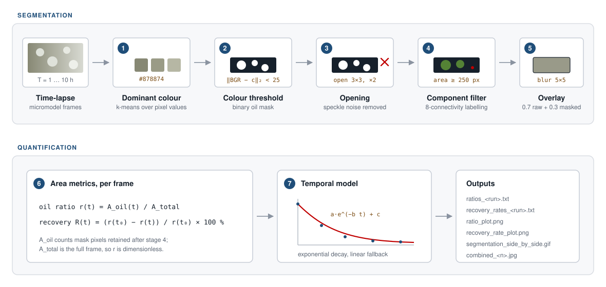
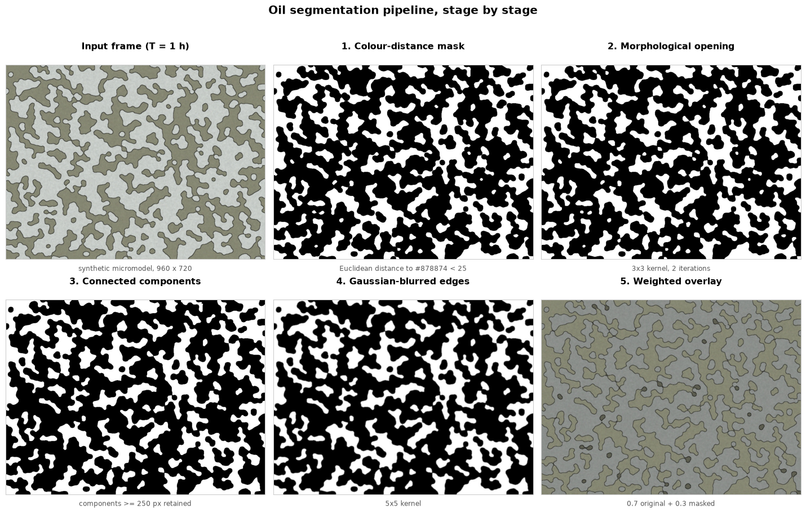
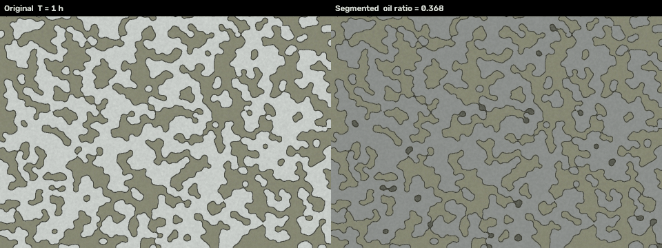
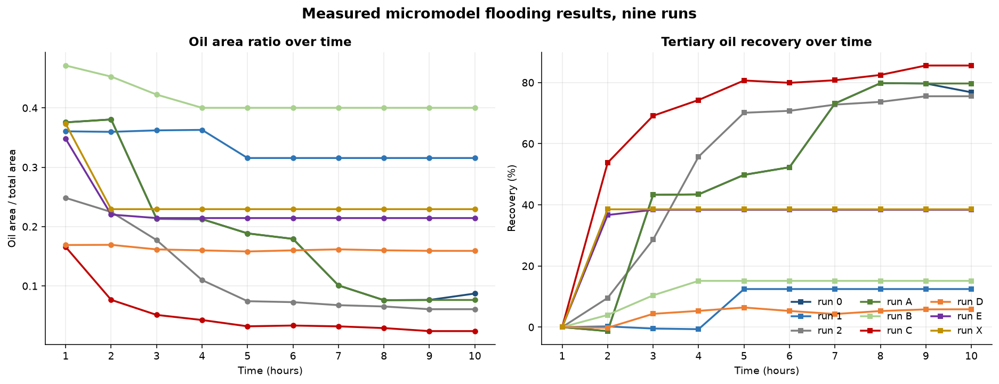
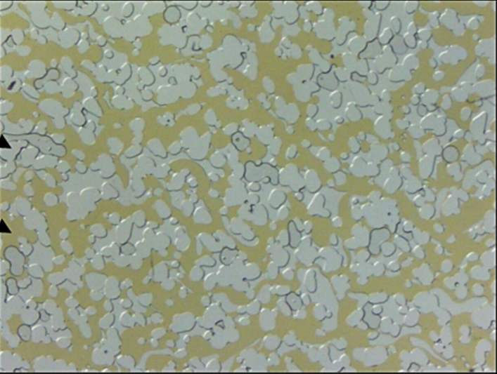
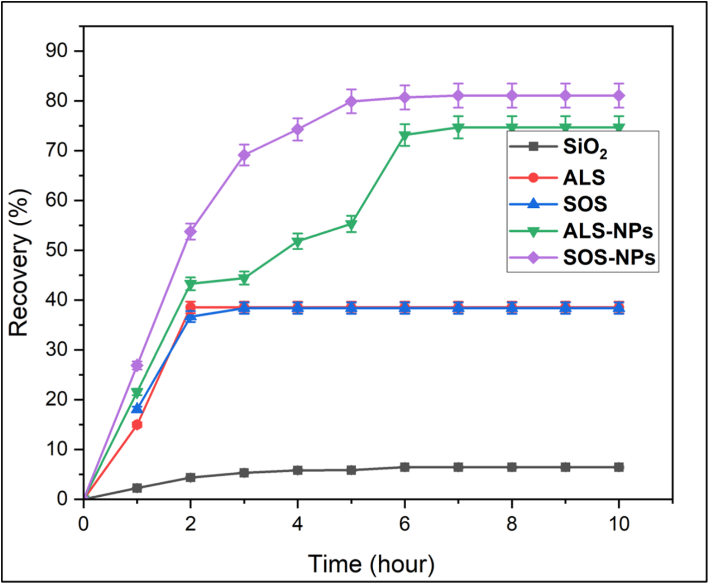

# Microchip Oil Segmentation

**Automated image analysis for quantifying oil recovery in microfluidic enhanced-oil-recovery experiments.**

[%20127021-1f4e79?style=flat-square)](https://doi.org/10.1016/j.molliq.2025.127021)
[](https://doi.org/10.1016/j.molliq.2025.127021)
[](https://creativecommons.org/licenses/by-nc-nd/4.0/)
[](https://www.python.org/)
[](https://opencv.org/)
[](LICENSE)
[](#project-status)

This repository holds the computer-vision software written for the micromodel
flooding tests in **Tliba *et al.* (2025)**, published in *Journal of Molecular
Liquids*. The study evaluates surfactant-functionalised silica nanoparticles
(ALS-NPs and SOS-NPs) for enhanced oil recovery. The code here turns ten-hour
time-lapse micrographs of an oil-wet microfluidic chip into per-frame oil
saturation measurements and the recovery curves reported in the paper.

---

## The paper

> **Spontaneous in-situ emulsification and enhanced oil recovery using functionalised silica nanoparticles: Insights from spontaneous imbibition and micromodel flooding tests**
>
> Louey Tliba, Mohamed Edokali, Thomas Moore, **Omar Choudhry**, Paul W. J. Glover, Robert Menzel, Ali Hassanpour
>
> *Journal of Molecular Liquids* **424** (2025) 127021
> [https://doi.org/10.1016/j.molliq.2025.127021](https://doi.org/10.1016/j.molliq.2025.127021)

### My contribution

I designed and built the image-analysis pipeline: segmentation of oil from the
raw micrographs, quantification of oil saturation over time, and statistical
modelling of the resulting recovery curves. In the paper's words, the movement
of nanofluid through the microchip was analysed using

> "custom-developed software that integrates advanced statistical modelling and
> automated image processing workflow (an OpenCV framework coupled with dynamic
> thresholding and Gaussian blurring)"

which "addressed one of the major challenges reported in previous methods: the
reduction of false positives and the enhancement of accuracy in distinguishing
oil from other phases". The tertiary recovery rates in **Fig. 13** of the paper
are the direct output of this pipeline.

---

## How it works



Oil appears in the micrographs as a distinctive olive tone against pale grey
solid grains. The pipeline exploits that colour separation rather than relying
on intensity alone:

| Stage | Operation | Purpose |
|:--|:--|:--|
| 1 | k-means clustering over pixel values | Recover the dominant oil colour as a HEX reference (`#878874`) |
| 2 | Euclidean colour distance in BGR, threshold `< 25` | Binary oil mask, tolerant of illumination drift |
| 3 | Morphological opening, 3x3 kernel, 2 iterations | Remove speckle wrongly matched on colour alone |
| 4 | Connected components, 8-connectivity, area `>= 250 px` | Discard residual fragments, keep genuine oil ganglia |
| 5 | Gaussian blur (5x5) and weighted overlay | Soften mask edges for the visual comparison frames |
| 6 | Pixel counting | Oil area ratio `r(t)` and recovery rate `R(t)` |
| 7 | Exponential decay fit, linear fallback | Model the temporal trend in recovery |

Recovery is expressed relative to the first frame:

```
r(t) = A_oil(t) / A_total
R(t) = (r(t0) - r(t)) / r(t0) x 100 %
```

### Worked example

Every stage, run end to end on a frame from the demo sequence:



The mask tightens at each step, from 37.61 % of the frame after colour
thresholding to 36.81 % after component filtering, the difference being noise
that the later stages remove.

Segmentation tracked across the full ten-frame sequence:



---

## Measured results

`Results/` holds the pipeline output for the nine micromodel flooding runs
analysed for the paper: oil area ratio and recovery rate at hourly intervals
across the ten-hour acquisition.



| Run | Final recovery | Run | Final recovery | Run | Final recovery |
|:--|--:|:--|--:|:--|--:|
| `0` | 76.80 % | `B` | 15.13 % | `E` | 38.37 % |
| `1` | 12.46 % | `C` | 85.56 % | `X` | 38.53 % |
| `2` | 75.51 % | `D` | 5.84 % | | |
| `A` | 79.68 % | | | | |

These are the raw per-run measurements. Published Fig. 13 aggregates repeat runs
per fluid, reporting roughly 6 % for unmodified SiO<sub>2</sub>, 38 % for the ALS
and SOS surfactants alone, 74 % for ALS-NPs and 80 % for SOS-NPs.

A per-frame mask-purity check accumulated in `errors.txt` averages **0.82 % over
89 analysed frames**. Because that bias is consistent across every image, it does
not affect the relative trends the study depends on.

### The experiment



The imaged region: a physical rock network etched into a microfluidic chip,
saturated with crude oil (olive) between solid grains (pale grey). Reproduced
from Fig. 1 of the paper.

<details>
<summary><b>Published Fig. 13, tertiary oil recovery rates</b></summary>

<br>



Reproduced from Tliba *et al.* (2025), *Journal of Molecular Liquids* **424**,
127021. © 2025 The Authors, published by Elsevier B.V. under
[CC BY-NC-ND 4.0](https://creativecommons.org/licenses/by-nc-nd/4.0/).

</details>

---

## Repository layout

```
cla.py                    Full analysis: segment a run, write ratios, recovery rates, plots and GIF
vis.py                    Single-frame variant that also saves each intermediate stage
script.py                 Batch driver across the nine run folders
rename.py                 Collect per-run outputs into Results/
archive/backup.py         Earlier exploratory version (k-means colour extraction, CLAHE)

demo/make_demo_data.py    Generate a synthetic ten-frame micromodel sequence
demo/run_demo.py          Run the pipeline over it and build the figures in this README
scripts/plot_results.py   Plot the measured results held in Results/

Results/                  Per-run oil area ratios and recovery rates (the measured data)
figures/                  Figures used above
docs/methodology.md       Original long-form methodology and library-selection notes
errors.txt                Accumulated mask-purity metric and frame count
```

## Reproducing the figures

The original micrographs are not redistributed here. The demo instead generates a
synthetic sequence with the same visual characteristics the pipeline was tuned
for, so everything below runs from a clean clone:

```bash
git clone https://github.com/omariosc/microchips.git
cd microchips
pip install -r requirements.txt

python demo/make_demo_data.py     # writes img/DEMO/T=1h.jpg ... T=10h.jpg
python demo/run_demo.py           # writes pipeline-stages.png, demo-sequence.gif, demo-recovery.png
python scripts/plot_results.py    # writes measured-recovery.png from Results/
```

To run against real acquisitions, place frames named `T=1h.jpg` ... `T=Nh.jpg` in
`img/<run>/` and call:

```bash
python cla.py --folder <run>
```

Outputs land in `out/<run>/` and are mirrored into `out_img/`.

> **Note.** `cla.py` appends to the tracked `errors.txt` as a side effect of each
> run, so the committed value there is the record from the published analysis
> (89 frames). Restore it with `git checkout -- errors.txt` after experimenting.

## Project status

Archived. The analysis is complete and published, and the code is preserved as
the computational record behind the micromodel results. Issues and pull requests
are not monitored.

## Citation

If you use this software, please cite both the paper and the software.
Machine-readable metadata is in [`CITATION.cff`](CITATION.cff).

```bibtex
@article{Tliba2025Spontaneous,
  title   = {Spontaneous in-situ emulsification and enhanced oil recovery using
             functionalised silica nanoparticles: Insights from spontaneous
             imbibition and micromodel flooding tests},
  author  = {Tliba, Louey and Edokali, Mohamed and Moore, Thomas and
             Choudhry, Omar and Glover, Paul W. J. and Menzel, Robert and
             Hassanpour, Ali},
  journal = {Journal of Molecular Liquids},
  volume  = {424},
  pages   = {127021},
  year    = {2025},
  doi     = {10.1016/j.molliq.2025.127021}
}

@software{Choudhry2025Microchips,
  title  = {Microchip Oil Segmentation: automated quantification of oil recovery
            in microfluidic EOR experiments},
  author = {Choudhry, Omar},
  year   = {2025},
  url    = {https://github.com/omariosc/microchips}
}
```

## Licence

Code is released under the [MIT licence](LICENSE).

Figures reproduced from the paper remain © 2025 The Authors, published by
Elsevier B.V. under [CC BY-NC-ND 4.0](https://creativecommons.org/licenses/by-nc-nd/4.0/),
and are included here under that licence with attribution.

---

Built by [Omar Choudhry](https://omarchoudhry.co.uk), School of Computing, University of Leeds.
